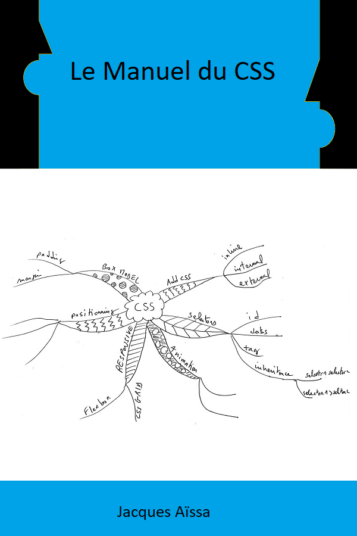

# Le Manuel du CSS

Je vous recommande de lire ce livre dans cet ordre mais vous pouvez aussi sauter à une partie de votre choix

* [Bien Commencer en CSS](https://github.com/nazimboudeffa/handbook-css/tree/main/get-started)
* Selecteurs
* Box Model
* Positionnement
* Responsive
* Animation
* Compilation

# La Règle des 3P+1

Passion, Persévérence, Pratique + Patience
