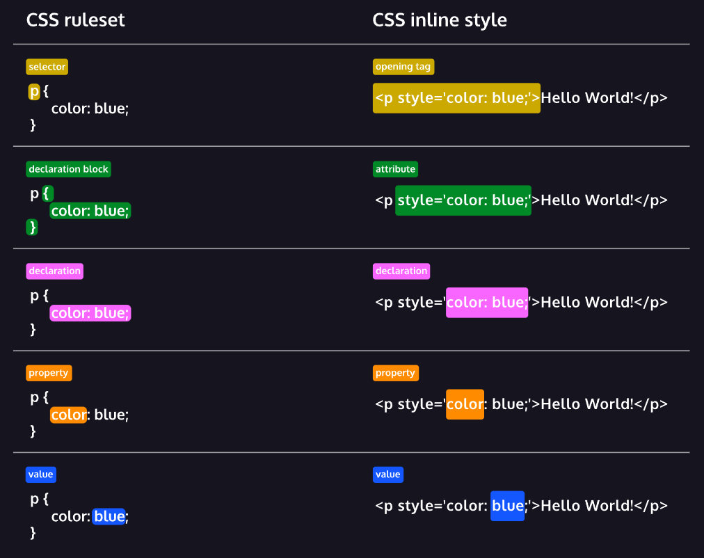

# La forme des règles CSS



# Différents selecteurs

Voici les principales façons d'affecter des propriétés CSS à des éléments

## Selecteur de type

par balise/élément/tag (selecteur de type)

```
p {
 ...
}
```

## Selecteur universel 

Il s'applique à tous les éléments et selectionne les elements de tous type, sert en général à faire un reset des propriétés du navigateur

```
* {
 ...
}
```

## Selecteur par classe 

Il permet de répéter les propriétés pour plusieurs autres éléments, c'est la manière la plus commune de selectionner un element

```
.ma-classe{
 ...
}
```

On peut ajouter plusieures classes à un element en les séparant par un espace

Exemple :

```
.green {
  color: green;
}
 
.bold {
  font-weight: bold;
}
```

`<h1 class='green bold'> ... </h1>`

## Selecteur par identificateur

Il permet de faire une selection unique d'un élément

```
#mon-id {
 ...
}
```

Il y a aussi d'autres manières d'affeter des propriétés CSS à un élément, les pseudo classes

# Combinateurs

Ciblage adjascent

```
div + p {
...
}
```

Ciblage général

```
div ~ p {
...
}
```

Enfant

```
div > p {
...
}
```

Descendant

```
div p {
...
}
```

# Pseudo classes

Pseudo classe | Description
--- | --- 
:active | an element being activated by the user (e.g. clicked). Mostly used on links or buttons
:checked | a checkbox, option or radio input types that are enabled
:default | the default in a set of choices (like, option in a select or radio buttons)
:disabled | an element disabled
:empty | an element with no children
:enabled | an element that's enabled (opposite to :disabled )
:firstchild | the first child of a group of siblings
:focus | the element with focus
:hover | an element hovered with the mouse
:last-child | the last child of a group of siblings
:link | a link that's not been visited
:not() | any element not matching the selector passed. E.g. :not(span)
:nthchild() | an element matching the specified position
:nth-lastchild() | an element matching the specific position, starting from the end
:only-child | an element without any siblings
:required | a form element with the required attribute set
:root | represents the html element. It's like targeting html , but it's more specific. Useful in CSS Variables.
:target | the element matching the current URL fragment (for inner navigation in the page)
